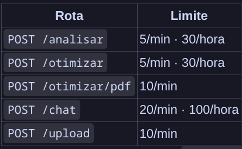

# parCV — Backlog

---

## Sprint 1

| | Título | Label | Pontos |
|-|:-------|:-----:|:------:|
| ✓ | Configurar ambiente virtual e dependências básicas (Flask, API de LLM) | infra | 3 |
| ✓ | Criar validação de variáveis de ambiente no boot | infra | 3 |
| ✓ | Criar versão inicial da tela de análise | ux | 5 |
| ✓ | Criar versão inicial da tela de chat | ux | 5 |
| ✓ | Adotar paleta de cores consistente | ux | 3 |
| ✓ | Empregar LLM maior para agilizar análise e respostas | feature | 3 |

> Foco: infra mínima funcional + primeiras telas.

---

## Sprint 2

| | Título | Label | Pontos |
|-|:-------|:-----:|:------:|
| ✓ | Suporte a upload de DOCX (python-docx) | feature | 5 |
| ✓ | Sugestão de palavras-chave da vaga que estão faltando no CV | feature | 5 |
| ✓ | Comparação lado-a-lado: currículo original vs. otimizado com diff visual | feature | 5 |
| ✓ | Sugestão de certificados relevantes para a vaga | feature | 5 |
| ✓ | Score parcial em tempo real (progress bar animada) | ux | 3 |

> Foco: produto utilizável de ponta a ponta — upload, análise inteligente, resultado visual.

---

## Sprint 3 - Atual

| | Título | Label | Pontos |
|-|:-------|:-----:|:------:|
| ✓ | Validação de tamanho máximo de upload e sanitização de input | security | 3 |
| ✓ | Rate limiting nas rotas /analisar e /otimizar | security | 3 |
| ✓ | 3 templates visuais de PDF (minimalista, moderno, acadêmico) | feature | 7 |
| ✓ | Edição manual do currículo otimizado antes de gerar PDF | feature | 5 |
| ✓ | Preview do PDF no navegador antes do download | ux | 3 |
| ✓ | Incluir foto e links clicáveis no PDF gerado | feature | 5 |

> Foco: segurança, regra de negócio e UX.

---

---

## Sprint 4 - Próxima

| | Título | Label | Pontos |
|-|:-------|:-----:|:------:|
|  | Adicionar logging estruturado (request ID, duração LLM) | infra | 3 |
|  | Persistir análises e currículos otimizados em banco de dados | feature | 7 |
|  | Endpoint GET /analises/\<id\> retornando JSON da análise | feature | 3 |
|  | Tela Histórico de Análises com listagem e detalhes | feature | 5 |
|  | Migrar sessão de chat do cookie para banco | feature | 5 |

> Foco: construir base de dados (persistência + histórico).

---

## Sprint 5

| | Título | Label | Pontos |
|-|:-------|:-----:|:------:|
|  | Botão Nova conversa e listagem de conversas na sidebar | ux | 5 |
|  | Upload de currículo no chat para perguntas contextuais | feature | 5 |
|  | Indicador de digitando e tratamento de erro inline no chat | ux | 3 |
|  | Simulação de entrevista com IA | feature | 7 |

> Foco: experiência mais rica no chat.

---

## Sprint 6

| | Título | Label | Pontos |
|-|:-------|:-----:|:------:|
|  | Landing page com explicação do produto e CTA | ux | 5 |
|  | CI/CD com GitHub Actions (lint, testes, build Docker) | infra | 5 |
|  | Deploy em VPS ou Railway/Render com HTTPS | infra | 5 |
|  | README atualizado com screenshots, arquitetura e contribuição | docs | 3 |

> Foco: documentação + pipeline de qualidade automatizado + deploy do MVP.
